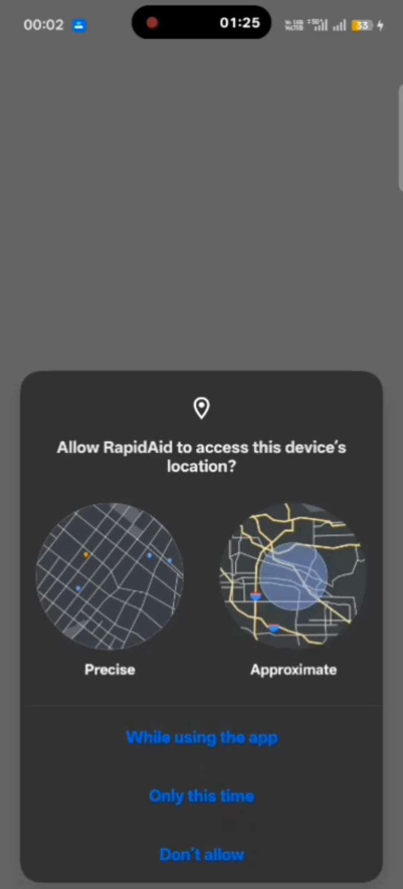
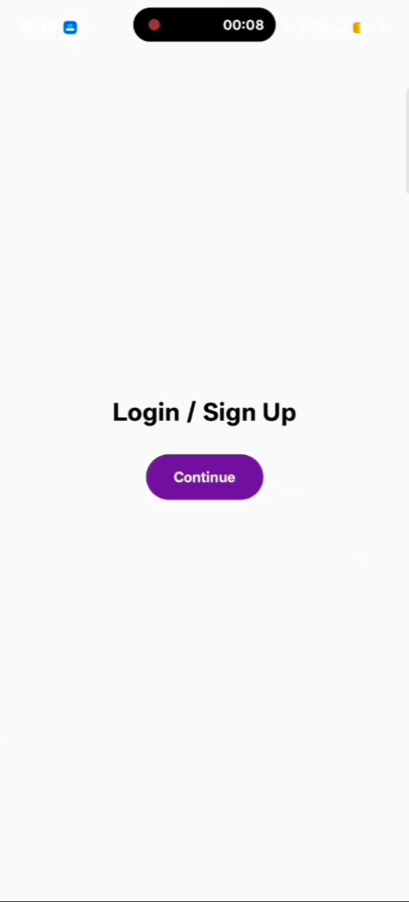
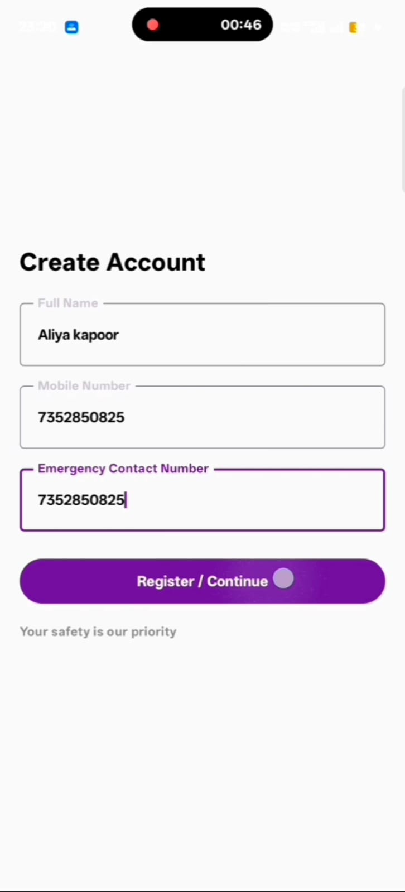
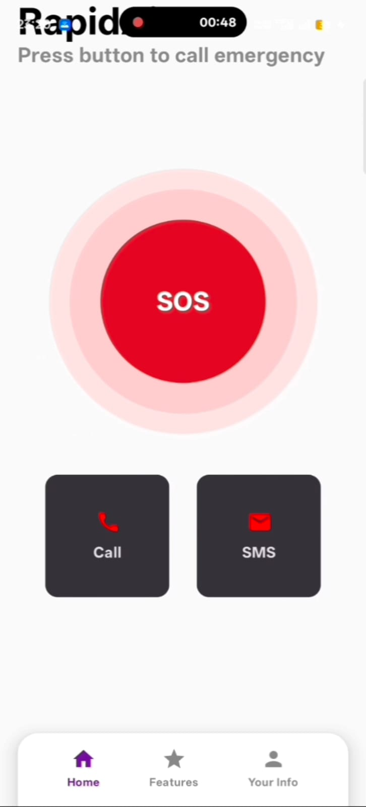
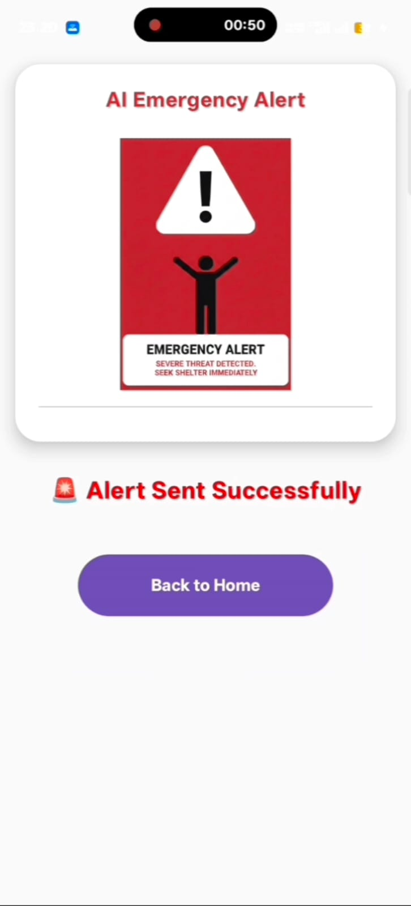
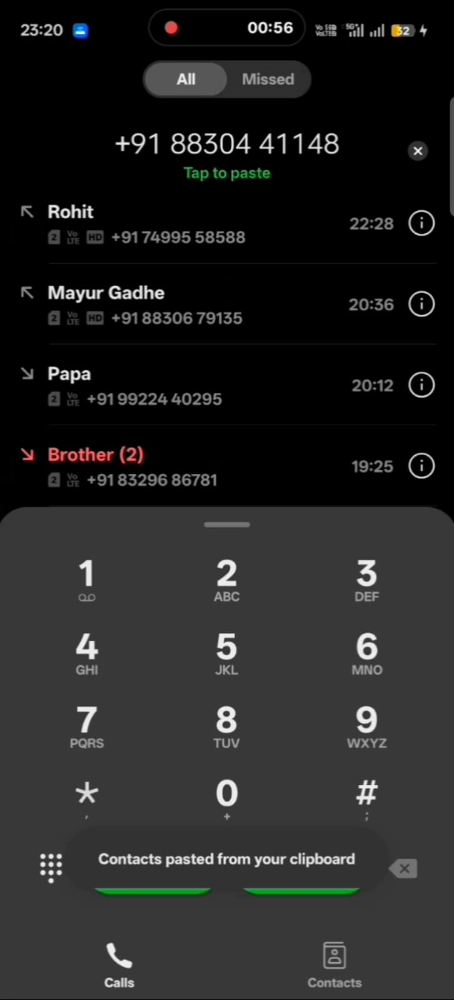
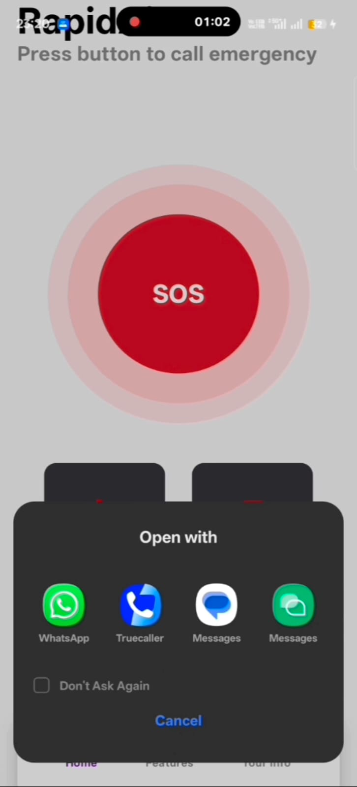

# RapidAid-Android-App
One-tap SOS Android app for fast emergency response using Kotlin and Jetpack Compose
RapidAid is a **smart, fast, and user-friendly Android SOS application** designed to help users get immediate assistance during emergency situations with **just one tap**.

In critical moments, even a few seconds matter. RapidAid reduces response time by providing a **simple SOS mechanism** without navigating complex menus.

---

## 🧩 Problem Statement

During emergencies such as:

- 🚗 Road accidents  
- 🏥 Medical emergencies  
- ⚠️ Unsafe or threatening situations  

People often panic and waste time unlocking phones, searching contacts, or dialing numbers.  
This delay can lead to **serious consequences or loss of life**.

---

## 💡 Solution

RapidAid solves this problem by offering:

- 🔴 **One-tap SOS emergency trigger**
- 📞 **Instant call access to emergency contacts**
- 💬 **Quick SMS option for alerting**
- 🧑‍💼 **Mandatory user details registration** to ensure accurate emergency response

👉 With RapidAid, **help is always one tap away**.

---

## ✨ Key Features

- 🔴 **One-Tap SOS Button**  
  Instantly triggers emergency actions

- 📞 **Emergency Call Shortcut**  
  Opens dialer with selected emergency contact

- 💬 **Emergency SMS Shortcut**  
  Opens messaging app instantly

- 🧑‍💼 **User Registration Flow**
  - Full Name  
  - Mobile Number  
  - Emergency Contact Number  

- 🎨 **Modern UI (Jetpack Compose)**  
  Clean, smooth, and responsive design

- 📱 **Android Optimized**  
  Lightweight and fast performance

---

## 🔄 Application Flow

1. App Launch  
2. Login / Sign Up  
3. User enters required details  
4. Home screen with SOS button  
5. SOS pressed  
6. Call / SMS triggered  
7. Alert confirmation shown  

---

## 🖼️ Screenshots

### Location Permission

### App Logo / Splash Screen

### Login Screen

### Create Account

### Home Screen (SOS)

### Alert Sent Screen

### Emergency Call Trigger

### Emergency SMS Trigger

---

## 🛠️ Tech Stack

- **Kotlin**
- **Android Studio**
- **Jetpack Compose**
- **Gradle**
- **Git & GitHub**

---

## 🎥 Demo Video

▶️ YouTube Demo  
https://youtube.com/shorts/lNuvnKJHsMc

---

## 🚀 Future Enhancements

- 📍 Live GPS location sharing  
- ☁️ Firebase backend integration  
- 🚓 Automatic alerts to hospitals / police  
- 📡 Background SOS trigger  
- 🌐 Multi-language support  

---

## 👨‍💻 Developed By

**Shubham Raju Nagpure**  
B.Sc. IT Student  
Android | Kotlin | Jetpack Compose  

---

## 👥 Team Members

- **Shubham Nagpure** – Android Development  
- **Mayur Gadhe** – Database & Testing  
- **Rohit Jambhulkar** – Logic & Backend  
- **Trushna Kundale** – UI/UX & Presentation  

---

⭐ *If you like this project, don’t forget to star the repository!* ⭐
